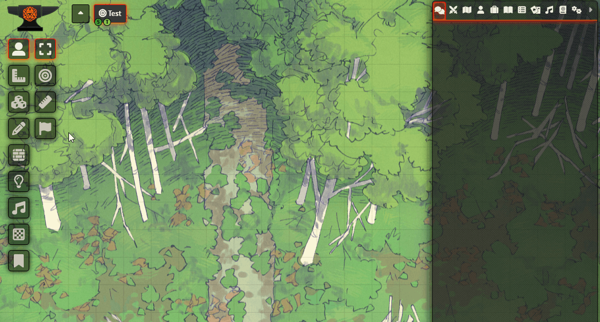

# BB's Red Flag

FoundryVTT module which adds a "red flag" button to the token control menu for players or GM to signal discomfort or issues during the game.

## Installation

To install BB's Red Flag module:

1. Go to the **Module Management** tab in Foundry VTT settings.
2. Click on **Install Module** and enter the manifest URL or upload the `.zip` file.

## Usage

-   The module adds a red flag button to the token control panel.
-   When pressed, a confirmation dialog appears, and upon confirmation a red flag notification is raised to all players and the GM.
-   An alert sound will be played if a proper file was chosen in the module settings.

## Localization

The module supports multiple languages. Current translations include:

-   English
-   German

## License

This module is released under the [MIT License](LICENSE).
